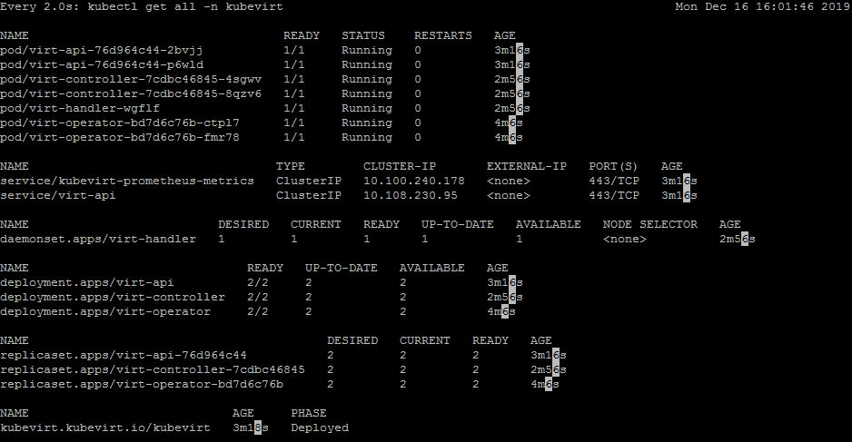

> Utilizing KubeVirt to run a Fedora VM on top of Kubernetes

[](https://github.com/cez-aug/github-project-boilerplate) [](https://creativecommons.org/publicdomain/zero/1.0/)

<br><br><br>

# KubeVirt

> _KubeVirt technology addresses the needs of development teams that have adopted or want to adopt Kubernetes but possess existing Virtual Machine-based workloads that cannot be easily containerized. More specifically, the technology provides a unified development platform where developers can build, modify, and deploy applications residing in both Application Containers as well as Virtual Machines in a common, shared environment._ 

## Project Dependencies
* Minikube 1.5.2+
* Kubectl 1.16.2+
* Docker 19.03.5+

## Steps for adding KubeVirt environment

### Install Virtctl
```
chmod +x resources/virtctl
sudo mv resources/virtctl /usr/bin
```

### Create KubeVirt Namespace
```
kubectl create ns kubevirt
```

### Turn on emulation mode
```
kubectl create configmap -n kubevirt kubevirt-config --from-literal debug.useEmulation=true
```

### Create and deploy KubeVirt operator to cluster
```
kubectl create -f resources/v0.24.0/kv-v0.24.0-operator.yaml

kubectl create -f resources/v0.24.0/kv-v0.24.0-cr.yaml
```

### Check status of operator creation
```
watch -d kubectl get all -n kubevirt
```



## Steps for adding CDI environment

### Create and deploy CDI operator to cluster
```
kubectl create -f resources/v0.24.0/cdi-v1.11.0-operator.yaml

kubectl create -f resources/v0.24.0/cdi-v1.11.0-cr.yaml
```


## Build image into PVC to test VM creation
```
mkdir fedora && cd $_
vim pvc_fedora1.yml
```

### PVC details
```
kind: PersistentVolumeClaim
apiVersion: v1
metadata:
  name: fedora1
  labels:
    app: containerized-data-importer
  annotations:
    cdi.kubevirt.io/storage.import.endpoint: "https://download.fedoraproject.org/pub/fedora/linux/releases/30/Cloud/x86_64/images/Fedora-Cloud-Base-30-1.2.x86_64.raw.xz"
spec:
  accessModes:
  - ReadWriteOnce
  resources:
    requests:
      storage: 10Gi
```

### Create the PVC with Fedora image
```
kubectl create -f pvc_fedora1.yml
#optional: watch the image download
kubectl logs -f $(kubectl get all | grep importer | cut -c -28)
```

### Wait for CDI image import to complete
> (K8s pod importer-fedora1-xxxxx will run then complete)
```
watch -d kubectl get all
```


> Check to make sure PVC claim is bound
```
kubectl get pvc
```


### Create VM and add public key

> Add public key to startup-scripts/fedora-startup-script.sh in project.

```
vim vm_fedora1.yml
```

### VM details
```
apiVersion: kubevirt.io/v1alpha3
kind: VirtualMachine
metadata:
  generation: 1
  labels:
    kubevirt.io/os: linux
  name: fedora1
spec:
  running: true
  template:
    metadata:
      creationTimestamp: null
      labels:
        kubevirt.io/domain: fedora1
    spec:
      domain:
        cpu:
          cores: 2
        devices:
          disks:
          - disk:
              bus: virtio
            name: disk0
          - cdrom:
              bus: sata
              readonly: true
            name: cloudinitdisk
        machine:
          type: q35
        resources:
          requests:
            memory: 4096M
      volumes:
      - name: disk0
        persistentVolumeClaim:
          claimName: fedora1
      - name: cloudinitdisk
        cloudInitNoCloud:
          userDataBase64: $(cat ../startup-scripts/fedora-startup-script.sh | base64 -w0) 
```

> __Note:__ <br>If command in __userDataBase64__ field doesn't produce value, run command outside of yaml and copy/paste into it 

### Apply to cluster and watch for creation
```
kubectl create -f vm_fedora1.yml
watch -d kubectl get all
virtctl console fedora1
```


### Create nodeport service for SSH access
```
virtctl expose vmi fedora1 --name=fedora1-ssh --port=22 --type=NodePort
```

### Grab nodeport created and ssh into box
```
kubectl get all
ssh fedora@<host machine ip> -p <service nodeport>
```


## Acknowledgments :thumbsup:

* [KubeVirt.io](https://kubevirt.io/). Great tutorials and code usage instructions

