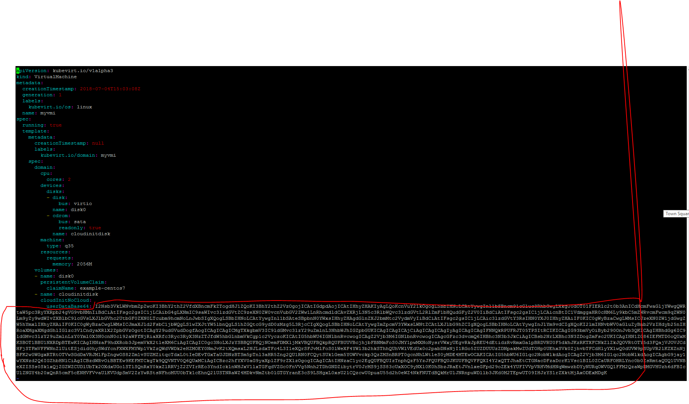

# Building Centos VMs on K8s

> Creating a CentOS VM

## Quick Start

### Update your startup-script.sh
Make sure you replace the public rsa key in the startup script with your public rsa key otherwise you will not be allowed to ssh to the vm

### Create the PVC and allow CDI to import CentOS7 bas image
Create the PVC

```kubectl create -f pvc-centos.yaml```

Verfiy that CDI is populating the pvc with the CentOS7 image
```
kubectl get all
#NAME                           READY   STATUS    RESTARTS   AGE
#pod/importer-example-centos7   1/1     Running   0          31s

#NAME                 TYPE       CLUSTER-IP     EXTERNAL-IP   PORT(S)          AGE
#service/centos-rdp   NodePort   10.43.42.96    <none>        3389:32091/TCP   2d8h
#service/centos-ssh   NodePort   10.43.170.67   <none>        22:31323/TCP     2d9h
#service/myvmi-rdp    NodePort   10.43.49.94    <none>        3389:30575/TCP   140m
#service/myvmi-ssh    NodePort   10.43.17.207   <none>        22:32171/TCP     164m

#NAME                      AGE    PHASE
#cdi.cdi.kubevirt.io/cdi   2d9h   Deployed

#NAME                               AGE
#cdiconfig.cdi.kubevirt.io/config   2d9h```
```

### Edit your vmi-centos.yaml file to include your startup-script.sh
Assuming you have alreadyed edited your startup-script.sh, enter the base64 encodded contents of that file into your vmi file.
```
cat startup-script.sh | base64 -w0
```

### Delete the encircled contents file and replace with your output from the previous command



### Launch the Virtual Machine Instnace
```kubectl create -f 

## View and modify Centos PVC

Centos image requires additional space compared to Fedora

> centos-pvc.yaml
```
---
apiVersion: v1
kind: PersistentVolumeClaim
metadata:
  name: "centos"
  labels:
    app: containerized-data-importer
  annotations:
    cdi.kubevirt.io/storage.import.endpoint: "https://cloud.centos.org/centos/7/images/CentOS-7-x86_64-GenericCloud-1907.qcow2"
spec:
  accessModes:
  - ReadWriteOnce
  resources:
    requests:
      storage: 8Gi #changed to 8Gi from 4Gi
  storageClassName: hostpath

```
## Apply PVC to bound to hostpath provisioner used previously

```
kubectl apply -f centos-pvc.yaml
# wait to complete image pull by CDI importer
watch -d kubectl get all
```
## Modify UserDataScript.sh appropriately with public key
```
#cloud-config

package_upgrade: false

packages:
  - git

users:
  - name: centos
    gecos: centos
    password: password
    lock-passwd: false
    sudo: ALL=(ALL) NOPASSWD:ALL
    ssh_authorized_keys:
      - # Add PubKey Here
  - name: user
    gecos: user
    lock-passwd: false
    sudo: ALL=(ALL) NOPASSWD:ALL
    ssh_authorized_keys:
      - # Add PubKey Here
```
## Apply centos1-vm.yaml
```
kubectl apply -f centos1-vm.yaml
# wait to complete VM creation process
watch -d kubectl get all
```

## Create nodeport service for SSH access
```
virtctl expose vmi centos1 --name=centos1-ssh --port=22 --type=NodePort
```

## Access VM via SSH
```
# grab service port
kubectl get all
user@<host machine ip> -p <nodeport service port>
```
